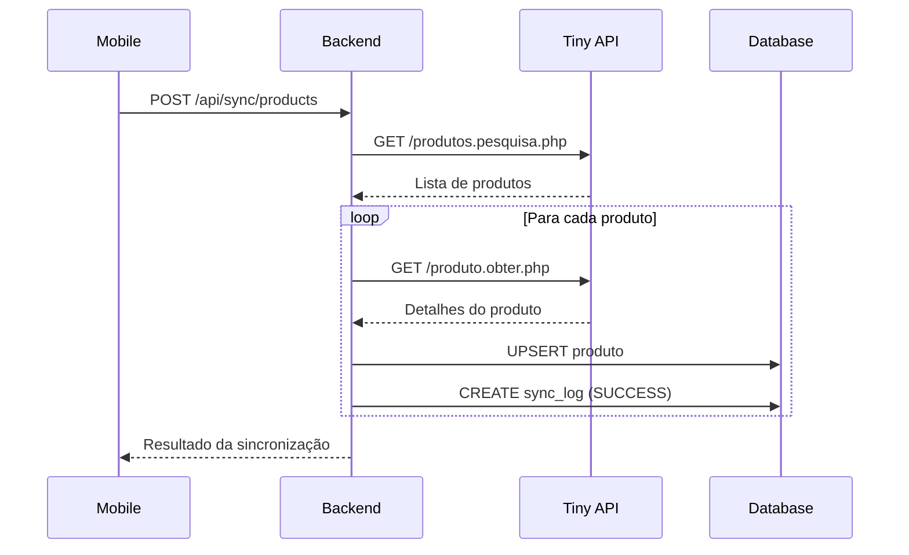
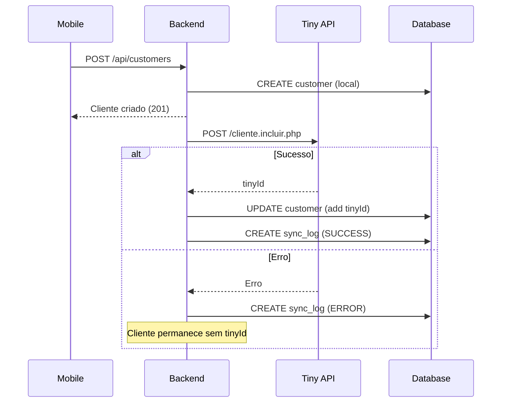
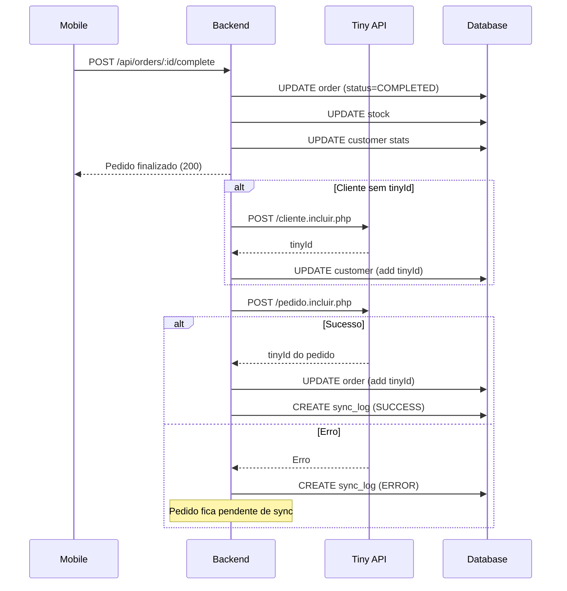

# 🔄 Integração Tiny ERP - Documentação Completa

**Data:** 10/01/2026  
**Versão:** 1.0.0  
**Status:** ✅ Implementado e Funcional

---

## 📋 Índice

1. [Vis ão Geral](#visão-geral)
2. [Configuração](#configuração)
3. [Funcionalidades](#funcionalidades)
4. [API Endpoints](#api-endpoints)
5. [Fluxos de Sincronização](#fluxos-de-sincronização)
6. [Testes](#testes)
7. [Troubleshooting](#troubleshooting)
8. [FAQ](#faq)

---

## 🎯 Visão Geral

A integração com Tiny ERP permite sincronização bidirecional de:
- **Produtos:** Importar catálogo do Tiny para o PDV
- **Clientes:** Criar clientes no Tiny ao cadastrar no PDV
- **Pedidos:** Enviar pedidos finalizados para o Tiny automaticamente

### Arquitetura

```
┌─────────────┐         ┌─────────────┐         ┌─────────────┐
│   Mobile    │ ──────> │   Backend   │ ──────> │  Tiny ERP   │
│     App     │ <────── │     API     │ <────── │     API     │
└─────────────┘         └─────────────┘         └─────────────┘
                               │
                               ↓
                        ┌─────────────┐
                        │ PostgreSQL  │
                        │  + SyncLog  │
                        └─────────────┘
```

### Componentes Implementados

- ✅ **TinyService:** Gerenciamento de todas as operações com API Tiny
- ✅ **SyncController:** Endpoints de sincronização
- ✅ **SyncLog:** Tabela de auditoria de sincronizações
- ✅ **Tela Mobile:** Interface para visualizar e gerenciar sincronizações
- ✅ **Retry Logic:** Tentativas automáticas em caso de falha
- ✅ **Auto-Sync:** Sincronização automática ao finalizar vendas

---

## ⚙️ Configuração

### 1. Token do Tiny ERP

Obtenha o token em: https://www.tiny.com.br/

1. Login → **Configurações** → **API**
2. Clicar em "**Gerar Token**"
3. Copiar token gerado

### 2. Variáveis de Ambiente

Arquivo: `pdv-system/apps/backend/.env`

```env
# Tiny ERP API
TINY_API_TOKEN="seu_token_aqui"
TINY_API_URL="https://api.tiny.com.br/api2"
TINY_API_FORMAT="JSON"

# Sincronização
SYNC_INTERVAL_MINUTES="30"
AUTO_SYNC_ON_START="true"
NOTIFY_SYNC_ERRORS="true"
```

### 3. Rede Local (para testes)

Arquivo: `pdv-system/apps/mobile/src/services/api.ts`

```typescript
// Configurado automaticamente para:
// - Android: http://192.168.0.211:3000/api
// - iOS: http://192.168.0.211:3000/api
```

### 4. Iniciar Sistema

```bash
# Opção 1: Script automático
cd /Users/guilhermevieira/Documents/pdv-system
./scripts/START_FULL_SYSTEM.sh

# Opção 2: Manual
# Terminal 1 - Banco
docker-compose up -d

# Terminal 2 - Backend
cd pdv-system/apps/backend
npm run dev

# Terminal 3 - Mobile
cd pdv-system/apps/mobile
npx expo start
```

---

## 🚀 Funcionalidades

### 1. Sincronização de Produtos

**Importa produtos do Tiny para o PDV**

- Busca todos os produtos ativos do Tiny
- **Filtra produtos:** Apenas produtos do tipo Normal (tipoVariacao = "N")
- **Rejeita produtos Kit:** Produtos com classe_produto = "K" não são importados
- **Rejeita variações:** Produtos com tipoVariacao = "P" ou "V" não são importados
- Mapeia campos (código, nome, preço, estoque, categoria, imagem)
- Cria ou atualiza produtos localmente
- Armazena `tinyId` para rastreamento
- Registra logs de sucesso/erro

**Tipos de Produtos (campo classe_produto):**
- ✅ **S** = Simples (produto normal) - **ACEITO**
- ❌ **K** = Kit (conjunto de produtos) - **REJEITADO** - Não baixar no PDV
- ❌ **V** = Com variações - **REJEITADO**
- ✅ **F** = Fabricado/Manufaturado - **ACEITO**
- ✅ **M** = Matéria-prima - **ACEITO**

**Tipos de Variação (campo tipoVariacao):**
- ✅ **N** = Normal (produto simples) - **ACEITO**
- ❌ **P** = Pai (produto com variações) - **REJEITADO**
- ❌ **V** = Variação (variante de um pai) - **REJEITADO**

**Gatilhos:**
- Manual via tela mobile (botão "Sincronizar Produtos")
- Manual via API: `POST /api/sync/products`

### 2. Sincronização de Clientes

**Cria clientes no Tiny ao cadastrar no PDV**

- Executado automaticamente ao criar cliente
- Mapeia dados (nome, telefone, CPF/CNPJ, endereço)
- Armazena `tinyId` retornado
- Não bloqueia criação local se falhar

**Gatilhos:**
- Automático ao criar cliente no PDV
- Automático ao finalizar venda com cliente sem `tinyId`

### 3. Envio de Pedidos

**Envia pedidos finalizados para o Tiny**

- Executado automaticamente ao finalizar venda
- Verifica se cliente tem `tinyId` (cria se necessário)
- Converte pedido para formato Tiny
- Mapeia método de pagamento
- Armazena `tinyId` do pedido

**Gatilhos:**
- Automático ao completar pedido
- Manual via tela mobile (pedidos pendentes)
- Manual via API: `POST /api/sync/orders/:orderId`

### 4. Logs e Auditoria

**Registra todas as operações**

- Operação executada
- Entidade afetada (product, customer, order)
- IDs local e Tiny
- Status (SUCCESS, ERROR, PENDING, RETRYING)
- Mensagem de erro (se houver)
- Número de tentativas
- Timestamp

---

## 📡 API Endpoints

### Testar Conexão

```http
GET /api/sync/test
Authorization: Bearer {token}
```

**Resposta:**
```json
{
  "success": true,
  "connected": true,
  "message": "Conexão com Tiny ERP estabelecida com sucesso"
}
```

---

### Sincronizar Produtos

```http
POST /api/sync/products
Authorization: Bearer {token}
```

**Resposta:**
```json
{
  "success": true,
  "message": "Sincronização de produtos concluída",
  "data": {
    "success": 15,
    "errors": 2,
    "total": 17,
    "details": [
      { "code": "PROD001", "status": "success" },
      { "code": "PROD002", "status": "error", "error": "Produto sem preço" }
    ]
  }
}
```

---

### Status da Sincronização

```http
GET /api/sync/status
Authorization: Bearer {token}
```

**Resposta:**
```json
{
  "success": true,
  "data": {
    "recentLogs": [...],
    "statusCounts": {
      "SUCCESS": 42,
      "ERROR": 3,
      "PENDING": 1
    },
    "lastProductSync": "2026-01-10T10:30:00.000Z",
    "pendingOrders": 2
  }
}
```

---

### Logs de Sincronização

```http
GET /api/sync/logs
Authorization: Bearer {token}

Query Parameters:
  - entity: product|customer|order
  - status: SUCCESS|ERROR|PENDING|RETRYING
  - operation: import_products|export_order|create_customer
  - limit: número (default: 50)
  - offset: número (default: 0)
```

---

### Retry de Sincronização

```http
POST /api/sync/retry/:logId
Authorization: Bearer {token}
```

---

### Sincronizar Pedido Específico

```http
POST /api/sync/orders/:orderId
Authorization: Bearer {token}
```

**Resposta:**
```json
{
  "success": true,
  "message": "Pedido sincronizado com sucesso",
  "data": {
    "tinyId": "123456789"
  }
}
```

---

### Pedidos Pendentes

```http
GET /api/sync/pending-orders
Authorization: Bearer {token}
```

**Resposta:**
```json
{
  "success": true,
  "data": [
    {
      "id": "uuid",
      "orderNumber": "260110-0001",
      "total": "125.50",
      "status": "COMPLETED",
      "createdAt": "2026-01-10T14:30:00.000Z",
      "customer": {
        "name": "João Silva",
        "phone": "11999999999"
      }
    }
  ],
  "count": 1
}
```

---

## 📋 Filtros de Produtos

### Produtos Aceitos vs. Rejeitados

A sincronização de produtos do Tiny ERP aplica filtros para garantir que apenas produtos vendáveis sejam importados para o PDV.

#### Campo `classe_produto` (Classificação do Produto)

Baseado na documentação oficial do Tiny ERP: [produto.obter](https://api.tiny.com.br/docs/api2/produtos/obter-produto)

| Valor | Descrição | Status | Motivo |
|-------|-----------|--------|--------|
| **S** | Simples | ✅ **ACEITO** | Produto normal vendável |
| **K** | Kit | ❌ **REJEITADO** | Kit é conjunto de produtos - não baixar no PDV |
| **V** | Com variações | ❌ **REJEITADO** | Produto com variações (ex: tamanhos/cores) |
| **F** | Fabricado/Manufaturado | ✅ **ACEITO** | Produto fabricado vendável |
| **M** | Matéria-prima | ✅ **ACEITO** | Matéria-prima vendável |

#### Campo `tipoVariacao` (Tipo de Variação)

| Valor | Descrição | Status | Motivo |
|-------|-----------|--------|--------|
| **N** | Normal | ✅ **ACEITO** | Produto simples sem variações |
| **P** | Pai | ❌ **REJEITADO** | Produto pai de variações - não vender diretamente |
| **V** | Variação | ❌ **REJEITADO** | Variação de um produto pai |

#### Campos SEO (Não Importados)

Os seguintes campos são usados apenas para e-commerce e não são importados:

- ❌ `seo_title` - Título para SEO
- ❌ `seo_keywords` - Palavras-chave
- ❌ `seo_description` - Descrição para SEO
- ❌ `slug` - URL amigável
- ❌ `link_video` - Link do vídeo

#### Exemplo de Log de Sincronização

```
[TinyService] ✅ Produto PROD-001 importado (classe: S, tipo: N)
[TinyService] ⏭️ Produto KIT-001 pulado: classe_produto = "K" (Kit - não baixar no PDV)
[TinyService] ⏭️ Produto VAR-001 pulado: tipoVariacao = "V" (variação)
```

---

## 🔄 Fluxos de Sincronização

### Fluxo 1: Sincronizar Produtos



### Fluxo 2: Criar Cliente com Sync



### Fluxo 3: Finalizar Pedido com Sync



---

## 🧪 Testes

### Teste 1: Conexão com Tiny

```bash
# Via curl
curl -X GET http://localhost:3000/api/sync/test \
  -H "Authorization: Bearer seu_token_jwt"

# Resultado esperado
{
  "success": true,
  "connected": true,
  "message": "Conexão com Tiny ERP estabelecida com sucesso"
}
```

✅ **Passou:** Conexão estabelecida  
❌ **Falhou:** Verificar token no `.env`

---

### Teste 2: Sincronizar Produtos

**No mobile:**
1. Login como Admin
2. Ir em "Sincronização"
3. Clicar "Sincronizar Produtos"
4. Aguardar conclusão
5. Ver resultado (X sucessos, Y erros)

**Via API:**
```bash
curl -X POST http://localhost:3000/api/sync/products \
  -H "Authorization: Bearer seu_token_jwt"
```

✅ **Passou:** Produtos importados e visíveis na tela Produtos  
❌ **Falhou:** Verificar logs em /api/sync/logs

---

### Teste 3: Criar Cliente e Sincronizar

1. Criar novo cliente no PDV
2. Verificar que `tinyId` foi preenchido
3. Buscar cliente no Tiny ERP
4. Confirmar que existe

**SQL para verificar:**
```sql
SELECT id, name, phone, tiny_id 
FROM customers 
WHERE tiny_id IS NOT NULL
ORDER BY created_at DESC
LIMIT 5;
```

---

### Teste 4: Finalizar Venda e Sincronizar

1. Criar pedido no PDV
2. Adicionar produtos
3. Selecionar cliente
4. Finalizar venda
5. Verificar logs do backend (deve mostrar sync)
6. Verificar pedido no Tiny ERP
7. Conferir se `tinyId` foi salvo

**SQL para verificar:**
```sql
SELECT id, order_number, tiny_id, status 
FROM orders 
WHERE status = 'COMPLETED'
ORDER BY completed_at DESC
LIMIT 5;
```

---

### Teste 5: Retry de Sincronização com Erro

1. Ir em "Sincronização" → aba "Logs"
2. Encontrar log com status ERROR
3. Clicar "Tentar Novamente"
4. Verificar se status mudou para SUCCESS

---

## 🔧 Troubleshooting

### Problema: "Token inválido"

**Causa:** Token do Tiny ERP incorreto ou expirado

**Solução:**
1. Acessar Tiny ERP
2. Gerar novo token
3. Atualizar `.env`:
   ```env
   TINY_API_TOKEN="novo_token_aqui"
   ```
4. Reiniciar backend

---

### Problema: "Produtos não sincronizam"

**Diagnóstico:**
```bash
# Ver logs
curl http://localhost:3000/api/sync/logs?entity=product&status=ERROR \
  -H "Authorization: Bearer seu_token"
```

**Causas comuns:**
- Produtos sem preço no Tiny
- Produtos sem código
- Limite de API atingido

**Solução:**
- Corrigir produtos no Tiny
- Aguardar limite de API resetar
- Tentar novamente após correção

---

### Problema: "Pedidos ficam pendentes"

**Diagnóstico:**
```bash
# Ver pedidos pendentes
curl http://localhost:3000/api/sync/pending-orders \
  -H "Authorization: Bearer seu_token"
```

**Causas comuns:**
- Cliente sem `tinyId`
- Produtos sem `tinyId`
- Erro de rede
- Formato de dados inválido

**Solução:**
1. Sincronizar produtos primeiro
2. Criar cliente no Tiny manualmente
3. Tentar sync manual do pedido:
   ```bash
   curl -X POST http://localhost:3000/api/sync/orders/ORDER_ID \
     -H "Authorization: Bearer seu_token"
   ```

---

### Problema: "Erro de rede ao sincronizar"

**Verificar:**
1. Backend está rodando: `curl http://localhost:3000/health`
2. Tiny API está acessível: `ping api.tiny.com.br`
3. Token está correto
4. Firewall não está bloqueando

**Solução:**
- Verificar conexão de internet
- Testar API do Tiny diretamente
- Ver logs detalhados: `tail -f /tmp/pdv-backend.log`

---

## ❓ FAQ

### 1. Com que frequência devo sincronizar produtos?

**Recomendação:** Uma vez por dia ou quando houver mudanças significativas no catálogo.

- Sincronização manual via mobile
- Agendar via cron (futuro)

---

### 2. O que acontece se o Tiny estiver offline?

- Operações locais **não são bloqueadas**
- Pedidos ficam com `tinyId = null`
- Logs registram erro
- Sistema tenta novamente automaticamente (retry)
- Admin pode sincronizar manualmente depois

---

### 3. Posso usar em produção com dados reais?

**Sim!** O sistema está pronto para produção:
- ✅ Tratamento robusto de erros
- ✅ Retry logic automático
- ✅ Logs completos
- ✅ Não bloqueia operações locais
- ✅ Transações seguras

**Recomendações:**
1. Testar em ambiente sandbox primeiro
2. Fazer backup do banco antes de sincronizar
3. Sincronizar poucos produtos inicialmente
4. Monitorar logs nas primeiras semanas

---

### 4. Como ver todos os logs de sincronização?

**No mobile:**
- Tela "Sincronização" → aba "Logs"

**Via API:**
```bash
curl http://localhost:3000/api/sync/logs \
  -H "Authorization: Bearer seu_token"
```

**No banco:**
```sql
SELECT * FROM sync_logs 
ORDER BY created_at DESC 
LIMIT 50;
```

---

### 5. Posso desativar sincronização automática?

**Sim!** Edite o `.env`:

```env
# Desativar auto-sync ao finalizar venda
AUTO_SYNC_ON_START="false"
```

Neste caso, use sincronização manual:
- Via tela mobile
- Via API: `POST /api/sync/orders/:orderId`

---

### 6. Como sincronizar um pedido antigo?

1. **Via Mobile:**
   - Sincronização → aba "Pendentes"
   - Clicar "Sincronizar Agora"

2. **Via API:**
   ```bash
   curl -X POST http://localhost:3000/api/sync/orders/ORDER_ID \
     -H "Authorization: Bearer seu_token"
   ```

---

## 📊 Monitoramento

### Métricas Importantes

**Acompanhe:**
- Taxa de sucesso de sincronizações
- Tempo médio de sync
- Pedidos pendentes
- Erros recorrentes

**Dashboard:** Tela mobile "Sincronização" → aba "Status"

**Query útil:**
```sql
SELECT 
  DATE(created_at) as date,
  status,
  COUNT(*) as count
FROM sync_logs
WHERE created_at >= NOW() - INTERVAL '7 days'
GROUP BY DATE(created_at), status
ORDER BY date DESC;
```

---

## 🚀 Próximas Melhorias

### Planejadas (Fase 2):
- [ ] Webhook do Tiny para atualizações em tempo real
- [ ] Sincronização de estoque bidirecional
- [ ] Importação de pedidos do Tiny para PDV
- [ ] Fila de sincronização com prioridades
- [ ] Notificações push para erros críticos
- [ ] Sincronização incremental (delta)
- [ ] Dashboard analytics avançado

---

## 📞 Suporte

**Problemas com integração:**
- Ver logs: `/tmp/pdv-backend.log`
- Ver status: Tela Sincronização no mobile
- API docs: http://localhost:3000/api

**Problemas com Tiny ERP:**
- Documentação: https://tiny.com.br/ajuda
- Suporte: https://ajuda.tiny.com.br/

---

**Versão:** 1.0.0  
**Última Atualização:** 10/01/2026  
**Desenvolvido por:** Claude + Guilherme Vieira
